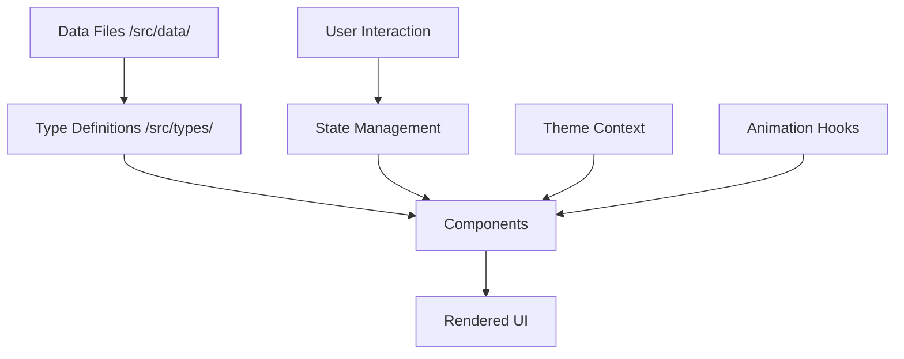

# Ortus Solutions - Modern Team Portfolio Website

<div align="center">

[](https://www.typescriptlang.org/)
[](https://reactjs.org/)
[](https://vitejs.dev/)
[](https://tailwindcss.com/)
[](LICENSE)

**A modern, high-performance team portfolio website showcasing data engineering expertise**

[View Demo](#) · [Report Bug](https://github.com/ortus-solutions/website/issues) · [Request Feature](https://github.com/ortus-solutions/website/issues)

</div>

---

## ✨ Overview

A professional team portfolio website built for **Ortus Solutions**, a data engineering consultancy specializing in scalable data pipelines and cloud automation. Features a modern glassmorphism design, smooth animations, and comprehensive team/project showcases.

### 🎯 Key Highlights

- **Team-focused architecture** - Showcase multiple team members with individual profiles
- **Project portfolio system** - Display case studies with team attribution
- **Advanced animations** - GSAP ScrollTrigger + Framer Motion for smooth UX
- **Type-safe development** - Full TypeScript implementation
- **Accessibility first** - WCAG compliant with ARIA support
- **Performance optimized** - 90+ Lighthouse scores

---

## 🚀 Tech Stack

### Core Technologies
- **React 18** - Modern hooks and concurrent features
- **TypeScript** - Type-safe development with strict mode
- **Vite 6** - Lightning-fast HMR and optimized builds
- **Tailwind CSS 3** - Utility-first styling with custom design system

### Animation & UX
- **Framer Motion** - Declarative animations and transitions
- **GSAP + ScrollTrigger** - Advanced scroll-based animations
- **Lenis** - Smooth scroll implementation
- **Three.js** (@react-three/fiber) - 3D particle background

### Forms & Validation
- **React Hook Form** - Performant form management
- **Zod** - Schema validation

### Icons & Assets
- **Lucide React** - Beautiful, consistent icon system

---

## 📋 Features

### 🎨 Design & UX
- ✅ Glassmorphism UI with backdrop blur effects
- ✅ Responsive design (mobile-first approach)
- ✅ Dark/Light mode with system preference detection
- ✅ Smooth scroll animations on every section
- ✅ Interactive 3D particle background (Hero section)
- ✅ Staggered entrance animations

### 👥 Team Showcase
- ✅ Team member cards with photos and bios
- ✅ Expandable biography sections
- ✅ Expertise tags and years of experience
- ✅ Social media links (LinkedIn, GitHub, Twitter, Email)
- ✅ Individual member profiles

### 💼 Project Portfolio
- ✅ Case study cards with team attribution
- ✅ Expandable project details (challenge, solution, results)
- ✅ Technology stack display
- ✅ Results metrics with visual emphasis
- ✅ Team member attribution per project

### 🔧 Technical Excellence
- ✅ SEO optimized with meta tags
- ✅ Accessible (WCAG 2.1 AA compliant)
- ✅ Fast loading (optimized images, lazy loading)
- ✅ Memory leak prevention (proper cleanup)
- ✅ Type-safe data management
- ✅ Component memoization for performance

---

## 🏗️ Architecture

### Project Structure

```
ortus-solutions-website/
├── src/
│   ├── components/
│   │   ├── Hero/              # Landing section with 3D background
│   │   ├── About/             # Company about section
│   │   │   ├── CompanyAbout.tsx
│   │   │   └── About.tsx (legacy)
│   │   ├── Team/              # Team showcase
│   │   │   ├── Team.tsx
│   │   │   └── TeamMemberCard.tsx
│   │   ├── Services/          # Service offerings
│   │   ├── Projects/          # Project portfolio
│   │   │   ├── ProjectsGallery.tsx
│   │   │   └── ProjectCard.tsx
│   │   ├── Process/           # Work process
│   │   ├── TechStack/         # Technologies used
│   │   ├── Contact/           # Contact form
│   │   └── common/            # Reusable components
│   │       ├── Button.tsx
│   │       ├── Card.tsx
│   │       ├── Header.tsx
│   │       ├── Footer.tsx
│   │       ├── ThemeToggle.tsx
│   │       ├── AnimatedCounter.tsx
│   │       └── ...
│   ├── contexts/
│   │   └── ThemeContext.tsx   # Dark/light mode management
│   ├── hooks/
│   │   ├── useGSAP.ts         # GSAP integration
│   │   ├── useLenis.ts        # Smooth scroll
│   │   └── useParallax.ts     # Parallax effects
│   ├── data/                  # Content management
│   │   ├── team.ts            # Team member data
│   │   ├── company.ts         # Company information
│   │   ├── project.ts         # Project case studies
│   │   ├── services.ts        # Service offerings
│   │   ├── process.ts         # Work process steps
│   │   ├── testimonial.ts     # Client testimonials
│   │   └── techStack.ts       # Technologies
│   ├── types/
│   │   └── index.ts           # TypeScript type definitions
│   ├── utils/
│   │   ├── constants.ts       # App-wide constants
│   │   ├── navigation.ts      # Scroll utilities
│   │   ├── image.ts           # Image error handling
│   │   └── cn.ts              # Class name utility
│   └── styles/
│       └── index.css          # Global styles & Tailwind
├── public/
│   └── images/                # Static assets
│       ├── team/              # Team member photos
│       ├── projects/          # Project screenshots
│       └── tech/              # Technology logos
├── docs/                      # Documentation
│   ├── development/           # Dev docs (PRD, standards, deployment)
│   └── transformation/        # Team transformation docs
├── .github/                   # GitHub templates
│   ├── ISSUE_TEMPLATE/
│   └── PULL_REQUEST_TEMPLATE.md
└── [config files]             # TypeScript, Vite, Tailwind, PostCSS
```

### Data Flow



---

## 🛠️ Getting Started

### Prerequisites

- **Node.js** 18+ (LTS recommended)
- **npm** or **yarn** or **pnpm**
- Git

### Installation

```bash
# Clone the repository
git clone https://github.com/ortus-solutions/website.git
cd ortus-solutions-website

# Install dependencies
npm install

# Start development server
npm run dev
```

The site will be available at `http://localhost:5173` with hot module replacement.

### Available Scripts

```bash
npm run dev          # Start development server
npm run build        # Build for production
npm run preview      # Preview production build locally
npm run lint         # Run ESLint
npm run type-check   # TypeScript type checking
```

---

## 📝 Customization

### 1. Update Team Information

Edit `src/data/team.ts`:

```typescript
export const teamMembers: TeamMember[] = [
  {
    id: 'member-1',
    name: 'Your Name',
    title: 'Senior Data Engineer',
    tagline: 'Building scalable data pipelines',
    bio: ['Paragraph 1', 'Paragraph 2', 'Paragraph 3'],
    photo: '/images/team/member-1.jpg',
    expertise: ['Python', 'AWS', 'Apache Airflow', 'PostgreSQL'],
    yearsOfExperience: 7,
    socialLinks: {
      linkedin: 'https://linkedin.com/in/yourprofile',
      github: 'https://github.com/yourusername',
      twitter: 'https://twitter.com/yourhandle',
      email: 'your.email@ortussolutions.com',
    },
  },
  // Add 2 more team members...
]
```

### 2. Add Project Case Studies

Edit `src/data/project.ts`:

```typescript
export const projects: Project[] = [
  {
    id: 'project-1',
    title: 'Enterprise Data Pipeline Modernization',
    client: 'FinTech Solutions Inc.',
    industry: 'Financial Technology',
    duration: '3 months',
    challenge: 'The problem description...',
    solution: 'How you solved it...',
    technologies: ['Python', 'Apache Airflow', 'AWS', 'Snowflake'],
    results: [
      { metric: 'Processing Time', value: '75% reduction', description: 'From 8 hours to 2 hours' },
      { metric: 'Data Quality', value: '99.9% accuracy', description: 'Automated quality checks' },
    ],
    images: ['/images/projects/project-1-hero.jpg'],
    teamMemberIds: ['member-1'], // Link to team members
  },
]
```

### 3. Update Company Information

Edit `src/data/company.ts`:

```typescript
export const companyInfo: CompanyInfo = {
  name: 'Ortus Solutions',
  tagline: 'Expert Data Engineering & Cloud Solutions',
  mission: 'We build data infrastructure that scales...',
  values: ['Technical Excellence', 'Clear Communication', 'Client Success'],
  founded: 'June 2025',
  description: ['Paragraph 1', 'Paragraph 2'],
  stats: {
    totalExperience: 18,    // Combined years
    projectsCompleted: 20,
    industriesServed: 5,
    happyClients: 15,
  },
}
```

### 4. Update Site Constants

Edit `src/utils/constants.ts`:

```typescript
export const SITE_NAME = 'Your Company'
export const CONTACT_EMAIL = 'contact@yourcompany.com'
export const SOCIAL_LINKS = {
  linkedin: 'https://linkedin.com/company/yourcompany',
  github: 'https://github.com/yourcompany',
  // ...
}
```

### 5. Customize Design

#### Colors

Edit `tailwind.config.js`:

```javascript
module.exports = {
  theme: {
    extend: {
      colors: {
        accent: {
          DEFAULT: '#06B6D4',  // Your brand color
          light: '#22D3EE',
        },
      },
    },
  },
}
```

#### Fonts

Update fonts in `tailwind.config.js`:

```javascript
fontFamily: {
  sans: ['Inter', 'system-ui', 'sans-serif'],
},
```

---

## 📦 Deployment

### Deploy to Vercel (Recommended)

[](https://vercel.com/new/clone?repository-url=https://github.com/ortus-solutions/website)

1. Push your code to GitHub
2. Import your repository on [Vercel](https://vercel.com)
3. Vercel auto-detects Vite configuration
4. Click "Deploy"
5. Add custom domain in project settings

### Deploy to Netlify

1. Build the project:
   ```bash
   npm run build
   ```
2. Upload `dist/` folder to Netlify
3. Or connect GitHub repo for continuous deployment
4. Build command: `npm run build`
5. Publish directory: `dist`

### Environment Variables

No environment variables are required for basic setup. If you add API integrations:

```bash
# .env.local
VITE_API_URL=https://your-api.com
VITE_ANALYTICS_ID=your-id
```

---

## 🧪 Testing

```bash
# Type checking
npm run type-check

# Linting
npm run lint

# Build test
npm run build && npm run preview
```

---

## 🤝 Contributing

We welcome contributions! Please see our [Contributing Guide](CONTRIBUTING.md) for details.

### Quick Start for Contributors

1. Fork the repository
2. Create a feature branch (`git checkout -b feature/amazing-feature`)
3. Make your changes
4. Run tests and linting (`npm run type-check && npm run lint`)
5. Commit your changes (use [Conventional Commits](https://www.conventionalcommits.org/))
6. Push to your branch (`git push origin feature/amazing-feature`)
7. Open a Pull Request

Please read our [Code of Conduct](CODE_OF_CONDUCT.md) before contributing.

---

## 📚 Documentation

- **[PRD](docs/development/PRD.md)** - Product Requirements Document
- **[Coding Standards](docs/development/CODING_STANDARDS.md)** - Development guidelines
- **[Deployment Guide](docs/development/DEPLOYMENT.md)** - Detailed deployment instructions
- **[Transformation Docs](docs/transformation/)** - Team site transformation documentation

---

## 🐛 Known Issues

None at this time. Please [report bugs](https://github.com/ortus-solutions/website/issues) if you find any!

---

## 🗺️ Roadmap

- [ ] Blog/Articles section
- [ ] Advanced filtering for projects
- [ ] Multi-language support (i18n)
- [ ] CMS integration for content management
- [ ] Automated testing suite
- [ ] Storybook component documentation

---

## 📄 License

This project is licensed under the MIT License - see the [LICENSE](LICENSE) file for details.

---

## 💬 Contact & Support

- **Website**: [ortussolutions.com](#)
- **Email**: contact@ortussolutions.com
- **GitHub Issues**: [Report a bug or request a feature](https://github.com/ortus-solutions/website/issues)

---

## 🙏 Acknowledgments

- Design inspiration from modern SaaS websites
- Icons by [Lucide](https://lucide.dev/)
- Animations powered by [Framer Motion](https://www.framer.com/motion/) and [GSAP](https://greensock.com/gsap/)
- Built with amazing open-source tools

---

<div align="center">

**Built with ❤️ using React, TypeScript, and Tailwind CSS**

⭐ Star this repo if you find it helpful!

</div>
